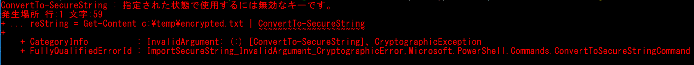
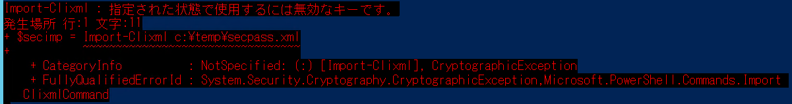

# 🔰Powershellで文字列の暗号化と復号化

## 🔰はじめに

Powershellにて平文でパスワード格納したくない！　って時に備えて暗号化と復号化の使い方。

ここではPowershell標準で用意されているコマンドを利用してパスワードの暗号化と復号化を行います。

- 暗号化復号化を同一ユーザで行う場合
- 暗号化復号化をそれぞれ異なるユーザで行う場合

上記のケースで手順が変わってくるのでそれぞれ説明します。

## 🔰今回使うPowershellコマンド

- [ConvertFrom-SecureString](https://docs.microsoft.com/en-us/powershell/module/microsoft.powershell.security/convertfrom-securestring?view=powershell-5.1)
- [ConvertTo-SecureString](https://docs.microsoft.com/en-us/powershell/module/microsoft.powershell.security/convertto-securestring?view=powershell-5.1)

### 💎ConvertFrom-SecureString

SecureStringオブジェクトを**暗号化された標準文字列**に変換する。

### 💎ConvertTo-SecureString

**暗号化された標準化文字列**をSecureStringオブジェクトに変換する。
また平文をSecureStringに変換することも出来る。

大まかな流れとしては、

1. ConvertTo-SecureStringで平文をSecureStringに変換
1. ConvertFrom-SecureStringでSecureStringを暗号化された標準化文字列に変換
1. 暗号化された標準化文字列をファイルに出力

※後々関係してくるコマンドのポイント

ConvertTo-SecureString/ConvertFrom-SecureStringはデフォルトでは[DPAPI(Data Protection Application Programming Interface)](https://ja.wikipedia.org/wiki/DPAPI)を利用して暗号化を行う。
keyオプションを指定すると[AES](https://ja.wikipedia.org/wiki/Advanced_Encryption_Standard)で暗号化します。

## 🔰暗号化復号化を同一ユーザで行う場合

### 💎暗号化の手順

1. ConvertTo-SecureStringでプレーンテキストをSecureStringオブジェクトに変換。
1. それをConvertFrom-SecureStringで暗号化された標準文字列に変換。
1. 暗号化された標準文字列をエクスポート

### 💎復号化の手順

1. 暗号化された標準文字列を読み込む。
1. 暗号化された標準もい列をConvertTo-SecureStringでSecureStringオブジェクトに変換
1. SecureStringからテキストを取得する※おまじないを唱える

※SecureStringからテキストを取得する場合は、SecureStringToBSTRとPtrToStringBSTRのおまじないで抜き出せます。

```powershell

#プレーンテキストをSecureStringオブジェクトに変換
$secureString = ConvertTo-SecureString -string "password1234" -AsPlainText -Force

#ConvertFrom-SecureStringはSecureStringオブジェクトを暗号化された標準文字列に変換する
$SecureString | ConvertFrom-SecureString | Out-File c:\temp\encrypted.txt

#暗号化したテキストをSecureStringオブジェクトに変換
$importSecureString = Get-Content c:\temp\encrypted.txt | ConvertTo-SecureString

#SecureStringから文字列を取り出すおまじない
$bstr = [System.Runtime.InteropServices.Marshal]::SecureStringToBSTR($importSecureString)
$StringPassword = [System.Runtime.InteropServices.Marshal]::PtrToStringBSTR($bstr)

write-host $StringPassword

```

### 💎暗号化復号化を同一ユーザで行う場合の別手順

ちなみにExport-Clixmlをつかっても、SecureStringを暗号化してエクスポートできたりする。

これはExport-ClixmlではSecureStringをデフォルトでDPAPIを使い暗号化してエクスポートしてくれるため。

- [Export-Clixmlのドキュメント](https://docs.microsoft.com/en-us/powershell/module/microsoft.powershell.utility/export-clixml?view=powershell-5.1)

上記ドキュメントに下記のように書いてる。

>The Export-Clixml cmdlet encrypts credential objects by using the Windows Data Protection API http://msdn.microsoft.com/library/windows/apps/xaml/hh464970.aspx. This ensures that only your user account can decrypt the contents of the credential object.

Export-Clixmlを使って書き出したファイルはImport-Clixmlを使って読み出せばSecureStringを復号化してインポートしてくれる。

```powershell

#プレーンテキストをSecureStringに変換
$SecureString = ConvertTo-SecureString -string "password1234" -AsPlainText -Force
#Export-Clixmlでエクスポート。
#このコマンドはSecureStringをDPAPIで暗号化してセキュアにエクスポートしてくれる。
$SecureString | Export-Clixml c:\temp\encrypted.xml

#暗号化されて格納されたデータをImport-Clixmlでインポート
$importSecureString = Import-Clixml c:\temp\encrypted.xml

#SecureStringから文字列を取り出すおまじない
$bstr = [System.Runtime.InteropServices.Marshal]::SecureStringToBSTR($importSecureString)
$StringPassword = [System.Runtime.InteropServices.Marshal]::PtrToStringBSTR($bstr)

write-host $StringPassword

```

## 🔰暗号化復号化をそれぞれ異なるユーザで行う場合

▶ユーザ1が暗号化したファイルをユーザ2で復号化しようとすると。  


**”指定された状態で使用するには無効なキーです”**　と怒られる。

▶一応、Import-Clixmlを使ったケースも。  


先に記載した通り、ConvertTo-SecureString/ConvertFrom-SecureStringはデフォルトでは[DPAPI](https://ja.wikipedia.org/wiki/DPAPI)で暗号化していて、ユーザが変わると鍵が変わって復号化できなくなっていそうです。

DPAPIの仕組みは[Windows Data Protection](https://msdn.microsoft.com/en-us/library/ms995355?ranMID=24542&ranEAID=TnL5HPStwNw&ranSiteID=TnL5HPStwNw-_dd1jHC7tQSU.O2i7vnSww&tduid=(934de9902a1a743779577e464f5b7639)(256380)(2459594)(TnL5HPStwNw-_dd1jHC7tQSU.O2i7vnSww)())に記載があるようですがかなり複雑。

ユーザだけかと思いきや、ドメインまで絡んできて色々と立て込んでそう。

ともかくこのようなケースでの解決方法としては、[DPAPI](https://ja.wikipedia.org/wiki/DPAPI)を利用せずに[AES](https://ja.wikipedia.org/wiki/Advanced_Encryption_Standard)で暗号化すればOK。

ConvertFrom-SecureStringではkeyオプションを指定すると、[AES](https://ja.wikipedia.org/wiki/Advanced_Encryption_Standard)を利用して暗号化された標準文字列に変換してくれます。

サンプルとしては下記。

### 💎暗号化サンプル

```powershell

#ユーザ1での作業

#プレーンテキストをSecureStringに変換
$SecureString = ConvertTo-SecureString -String "password1234" -AsPlainText -Force

#暗号化用のバイト配列を作成(192bit)
#※8bitの要素が24個で192bit。
#このバイト配列は復号化する際に必要になります。
#大切に保管しましょう。
[byte[]] $EncryptedKey = (3,4,2,3,56,34,254,222,1,1,2,23,42,54,33,233,1,34,2,7,6,5,35,43)

#セキュアストリングを暗号化された標準文字列に変換
$encrypted = ConvertFrom-SecureString -SecureString $SecureString -key $EncryptedKey
#暗号化された標準文字列を出力
$encrypted | Out-File c:\temp\encrypted.txt


```

今回はkeyに192bitのバイト配列(8bit*24)を設定したが、設定できるkey長は128,192,256bit。

また.netのSecurity.Cryptography.RNGCryptoServiceProviderクラスにバイト配列をランダムなデータで埋めてくれるやつがあるので下記のようにkeyを生成できたりもする。

```Powershell
#8*24で192bitのバイト配列を作成
$EncryptedKey = New-Object Byte[] 24

#RNGCryptoServiceProviderクラスをcreateしてGetBytesメソッドでバイト配列をランダムなデータで埋める。
[Security.Cryptography.RNGCryptoServiceProvider]::Create().GetBytes($EncryptedKey)
```

### 💎復号化サンプル

```powershell
#ユーザ2での復号

#暗号化で使用したバイト配列を用意
[byte[]] $EncryptedKey = (3,4,2,3,56,34,254,222,1,1,2,23,42,54,33,233,1,34,2,7,6,5,35,43)

#暗号化された標準文字列をインポートしてSecureStringに変換
$importSecureString = Get-Content c:\temp\encrypted.txt | ConvertTo-SecureString -key $EncryptedKey

#SecureStringから文字列を取り出すおまじない
$bstr = [System.Runtime.InteropServices.Marshal]::SecureStringToBSTR($importSecureString)
$StringPassword = [System.Runtime.InteropServices.Marshal]::PtrToStringBSTR($bstr)

write-host $StringPassword

```

## 🔰総評

ConvertFrom-SecureString/ConvertTo-SecureStringは標準では[DPAPI](https://ja.wikipedia.org/wiki/DPAPI)で暗号化するってのは知っておいたほうが良い。

意識してないと復号化できなくてエラーなんて自体を起こしてしまう事もあるかもしれません。

[DPAPI](https://ja.wikipedia.org/wiki/DPAPI)を利用しない場合は、[AES](https://ja.wikipedia.org/wiki/Advanced_Encryption_Standard)を利用することになるが、暗号化に利用するバイト配列(EncryptedKey)をどのように扱うのがいいかは少し悩む所ですね。

誰でもアクセスできる所に置いておくのは論外ですし、復号化出来るユーザだけが読める領域に格納するってのもまた一手間かかりますし。
